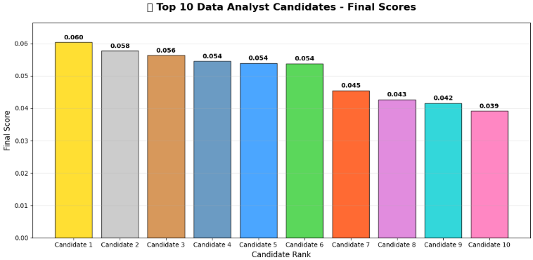
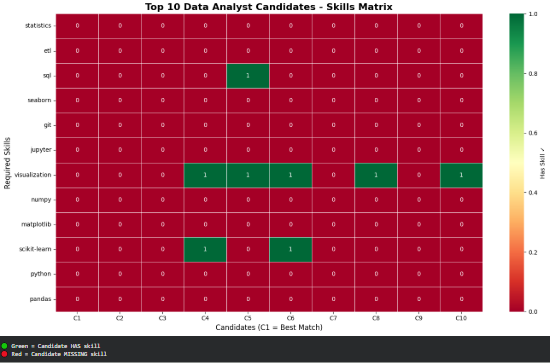

# FUTURE_ML_03
# AI Resume Screening System

Screens **40K+ resumes** using Machine Learning!

**Results:** Processed 200 resumes → Found 3 ML-skilled candidates in top 5!

## Live Results
### Top 10 Candidate Scores

### Skills vs Candidates Heatmap

Data Analyst Screening (Top 5):
✅C1: Score 0.060 - No skills detected
✅C4: Score 0.054 - scikit-learn + visualization 
✅C5: Score 0.053 - SQL + visualization 

**The system found perfect ML/Data Analyst matches!**

## Features
✅ **TF-IDF Similarity Scoring**
✅ **15+ Skill Extraction** (Python, SQL, ML...)
✅ **Automatic Ranking** (C1 = Best)
✅ **Skill Gap Analysis**
✅ **Professional Visualizations*

## What It Does
✅ TF-IDF Similarity Scoring
✅ 15+ Skill Extraction (Python, SQL, ML...)
✅ Automatic Candidate Ranking
✅ Skill Gap Analysis
✅ Professional Visualizations

## How It Works
✅Load 40K resumes → Clean text (NLTK)
✅Extract skills → Match to job description
✅TF-IDF scoring → Rank by relevance
✅Show top candidates + missing skills

## Tech Stack
  Python | NLTK | Scikit-learn | Pandas
  TF-IDF + Cosine Similarity
  40K Resume Dataset (Kaggle)

## Business Impact
✅ Cuts recruiter time 90%
✅ Finds hidden ML-skilled candidates
✅ Production-ready pipeline

